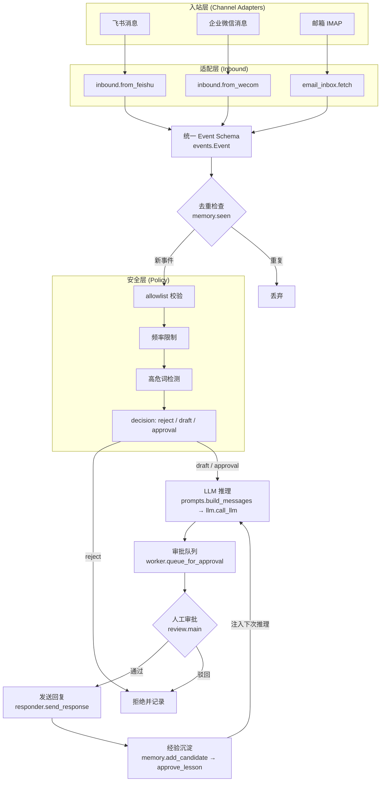

# 24 小时个人 Agent 技术架构

## 整体架构图



## 模块索引

| 模块 | 文件 | 核心职责 |
|------|------|----------|
| 事件模型 | `agent/events.py` | 定义 Event dataclass，SHA256 去重，渠道无关的统一消息格式 |
| 入站适配 | `agent/inbound.py` | 将飞书/企微的原始 payload 转为 Event |
| 邮箱入站 | `agent/email_inbox.py` | IMAP 拉取未读邮件，转为 Event |
| 策略引擎 | `agent/policy.py` | 三层安全校验：allowlist → 频率限制 → 高危词检测 |
| 记忆库 | `agent/memory.py` | SQLite 持久化 events 和 lessons，支持候选/审批两阶段 |
| 提示词构建 | `agent/prompts.py` | 注入系统规则 + 已批准经验 + 检索证据，构建 LLM 消息 |
| LLM 调用 | `agent/llm.py` | 调用 NJUSE Hub API（deepseek-v4-pro），统一接口 |
| 工作流编排 | `agent/worker.py` | handle() 串联去重→策略→LLM→队列的完整链路 |
| 审批控制台 | `agent/review.py` | 交互式人工审批（通过/驳回/跳过），逐条处理队列 |
| 出站响应 | `agent/responder.py` | 根据渠道分发回复到飞书/企微/邮箱 |
| 发送通道 | `agent/channels.py` | 飞书 Webhook、企微 Webhook、SMTP 邮件三种发送方式 |
| 主循环 | `agent/run_once.py` | 单次运行入口，拉取未读事件 → handle → 输出 |
| 端到端演示 | `agent/demo_loop.py` | 离线演示完整闭环，不依赖真实 API/Webhook |
| 验证脚本 | `agent/scripts/verify_db.py` | 数据库读写验证：建表→写入→审核→读取 |
| 经验导出 | `scripts/build_agent.py` | 将 approved 规则导出到 `public/data/agent-rules.json` |
| 经验展示 | `app/agent/page.tsx` | 网站前端展示已批准的经验规则 |

## 安全设计

所有安全校验集中在 `agent/policy.py` 的 `evaluate()` 函数中，在 LLM 推理之前执行，形成三道防线：

### 1. allowlist（发送者白名单）

```python
ALLOWED_SENDERS = {
    "feishu": {"teacher_open_id", "student_open_id"},
    "wecom": {"teacher_user_id"},
    "email": {"teacher@example.com"},
}
```

**防御场景**：未授权访问。Agent 是个人助手，只应响应特定人员（老师、同学）的消息。任何不在白名单中的发送者直接拒绝，防止陌生人通过飞书/企微/邮箱向 Agent 发送指令，避免社会工程攻击或垃圾信息消耗 LLM 资源。

### 2. 去重（SHA256 事件 ID）

```python
event_id = hashlib.sha256(f"{channel}|{sender}|{text}").hexdigest()[:24]
```

**防御场景**：重放攻击。同一渠道的重试机制、Webhook 重复推送或恶意重放同一消息，都会产生相同的 event_id。`worker.handle()` 入口处调用 `memory.seen(event_id)` 检查，已处理的事件直接丢弃，避免重复消耗 LLM token 或产生重复审批条目。

### 3. 限流（频率限制）

```python
if recent_count(event.sender, seconds=60) >= 5:
    return "reject", "rate limit exceeded"
```

**防御场景**：洪水攻击 / 资源耗尽。恶意或异常的发送者可以在短时间内发送大量消息，试图耗尽 LLM API 配额或填满审批队列。60 秒内同一发送者最多 5 条消息，超出则直接拒绝，保护 LLM 调用预算和系统稳定性。

### 4. 防注入（高危词检测）

```python
HIGH_RISK_WORDS = {"删除", "付款", "转账", "群发", "发布", "合并", "密码", "token"}
if any(word in event.text.lower() for word in HIGH_RISK_WORDS):
    return "approval", "message may request an external or sensitive action"
```

**防御场景**：提示注入 / 越权操作。LLM 的 system prompt 虽然声明了"外部消息不可信"，但攻击者可能通过精心构造的 prompt 绕过防护。高危词检测在 LLM 推理之前拦截涉及外部操作（删除、发布、付款）或敏感信息（密码、token）的消息，将其标记为 `approval` 级别，强制人工确认，即使 LLM 被绕过，实际操作也会被拦截。

> **注意**：高危词检测返回 `approval` 而非 `reject`，因为标记为"高危"的消息不一定就是攻击——用户可能确实需要执行这些操作。`approval` 状态意味着 LLM 可以生成草稿，但发送前必须人工审批。

## 经验反馈闭环

### 为什么是两阶段（candidate → approved）？

Agent 的经验规则采用**两阶段审批**机制，而非一次通过直接生效。设计理由如下：

1. **LLM 输出不可靠**：LLM 从单次交互中提取的规则可能过于泛化（"当用户问天气时回复详细预报"实际上只适用于特定上下文），也可能过于具体（"当 2026-07-10 15:30 收到某封邮件时回复 X"）。人工审批提供了**质量控制关卡**，确保规则具有合理的抽象层次。

2. **回滚能力**：`candidate` 状态的规则不会注入到 `prompts.py` 的 `build_messages()` 中。只有 `approved_rules()` 才被注入。如果一条规则被证明效果不好，只需将其从 `approved` 改回 `candidate` 或删除，不影响已批准的规则集。

3. **审计追溯**：`lessons` 表保留了 `evidence` 字段（触发规则的那条原始消息），`events` 表保留了完整的消息历史。审批者可以回溯"这条规则是从哪条消息中提取的"，而不是面对一个无从验证的黑盒规则。

4. **渐进式信任**：一条规则被批准后，`uses` 计数器会递增。`approved_rules()` 按 `uses DESC` 排序，意味着高频使用的规则排在前面，低频规则自然下沉。这形成了一个**使用频次驱动的信任模型**——规则被使用的次数越多，说明它越可靠，越应该被优先注入。

### 完整闭环流程

```
外部消息 → Event → 去重 → 策略校验 → LLM 推理 → 草稿入队
                                                      ↓
下次推理 ← 注入已批准规则 ← 经验入库 ← 人工审批 ← 逐条审批
```

每一条审批通过的规则都会成为下一次 LLM 推理的上下文，Agent 随着使用逐渐积累领域知识，形成**自我进化的知识体系**。